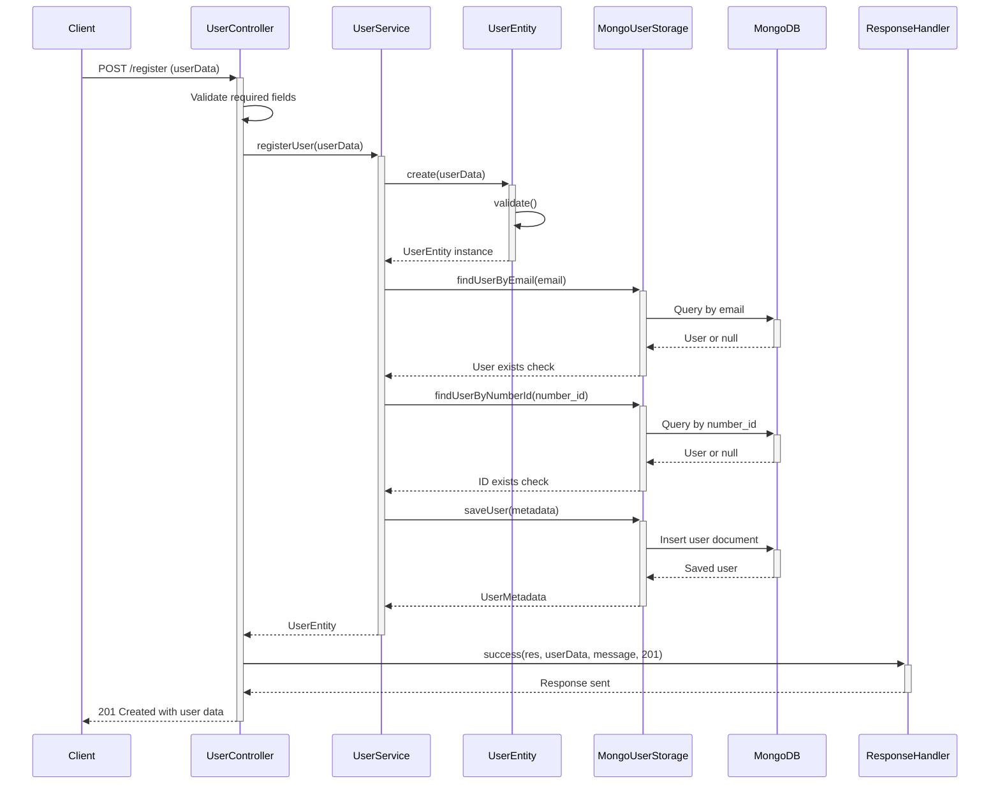
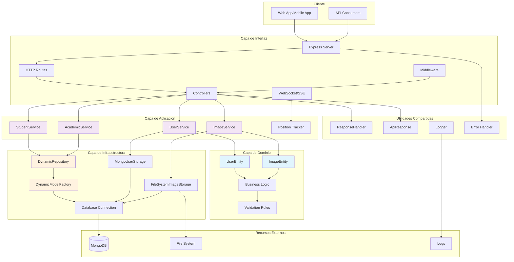

# 📊 Diagramas de Arquitectura - FormArte API

Este documento contiene los diagramas de arquitectura del sistema FormArte API, basados en el análisis del código fuente real.

## Índice
- [Diagrama de Clases](#diagrama-de-clases)
- [Diagrama de Secuencia](#diagrama-de-secuencia)
- [Diagrama de Componentes](#diagrama-de-componentes)

---

## Diagrama de Clases

Muestra la estructura completa de clases, entidades y servicios del sistema.

```mermaid
classDiagram
    %% Domain Layer - Entities
    class UserMetadata {
        +number type_id
        +string number_id
        +string name
        +string second_name
        +string last_name
        +string second_last
        +string email
        +string password
        +string cellphone
        +string locate_district
        +string type_user
        +string gender
        +string programa
        +string birthday
        +Date createdAt
    }

    class UserEntity {
        -UserMetadata metadata
        +create(userData) UserEntity
        +getMetadata() UserMetadata
        +validate() boolean
    }

    class ImageMetadata {
        +string filename
        +string mimeType
        +number size
        +Date createdAt
    }

    class ImageEntity {
        -string id
        -ImageMetadata metadata
        -string url
        -string fullUrl
        +create(metadata, url, fullUrl) ImageEntity
        +getId() string
        +getMetadata() ImageMetadata
        +getUrl() string
        +getFullUrl() string
        +toJSON() object
    }

    %% Application Layer - Services
    class UserService {
        -UserStoragePort userStorage
        +registerUser(userData) UserEntity
        +loginUser(email, password) object
    }

    class StudentService {
        -DynamicRepository repository
        +getStudentPosition(grado, id_student) StudentPosition
        +updateStudentsBulk(collection, students) BulkUpdateResult
        +createStudentsUnique(collection, students) BulkCreateResult
        +getStudentById(collection, id) any
        +updateStudent(collection, id, data) any
        +deleteStudent(collection, id) any
        +getAllStudents(collection) any[]
        +removeExamenAsignado(ids, id_simulacro) object
    }

    class AcademicService {
        -DynamicRepository repository
        +getAreasByIds(grado, ids) AreaWithQuestions[]
        +getSubjectsByIds(grado, ids) SubjectWithQuestions[]
        +getSubjectById(id, grado) SubjectWithQuestions
        +generateSimulacro(value, cantidad) SimulacroData
        +getQuestionById(id) any
        +getQuestionsByTypeAndArea(programa, area) QuestionsByTypeAndArea[]
        +getAcademicLevelByScore(collection, id, score) any
    }

    class ImageService {
        -ImageStoragePort imageStorage
        +uploadImage(imageBase64, requestInfo) ImageEntity
        +uploadMultipleImages(imagesBase64, requestInfo) ImageEntity[]
    }

    %% Infrastructure Layer
    class DynamicModelFactory {
        -Map~string,Model~ modelCache
        -Map~string,Schema~ schemaCache
        -CacheStats cacheStats
        +getInstance() DynamicModelFactory
        +getModel(collection, schema, options) Model
        +preloadModels(collections) void
        +invalidateCache(collection) void
        +getCacheStats() CacheStats
        +getCollectionStats(collection) object
    }

    class DynamicRepository {
        -DynamicModelFactory modelFactory
        +findById(collection, id) any
        +findOne(collection, query) any
        +find(collection, query, projection) any[]
        +create(collection, data) any
        +updateById(collection, id, data) any
        +deleteById(collection, id) any
        +bulkUpdate(collection, students) BulkUpdateResult
        +bulkCreateUnique(collection, students) BulkCreateResult
        +searchByField(collection, field, value) any[]
    }

    class MongoUserStorage {
        +saveUser(metadata) UserMetadata
        +findUserByEmail(email) UserMetadata
        +findUserByNumberId(numberId) UserMetadata
        +validateUserCredentials(email, password) UserMetadata
    }

    class FileSystemImageStorage {
        +saveImage(buffer, metadata, requestInfo) object
        +saveMultipleImages(images, requestInfo) object[]
    }

    %% Interface Layer - Controllers
    class UserController {
        +registerUser(req, res) void
        +loginUser(req, res) void
    }

    class ImageController {
        +uploadImage(req, res) void
        +uploadMultipleImages(req, res) void
    }

    %% Utility Classes
    class ApiResponse {
        +success(res, data, message, statusCode, meta) Response
        +error(res, error, statusCode, details) Response
        +paginated(res, data, page, limit, total, message) Response
        +created(res, data, message) Response
        +updated(res, data, message) Response
        +deleted(res, message) Response
        +notFound(res, message) Response
        +badRequest(res, message, details) Response
        +bulk(res, results, message) Response
    }

    class ResponseHandler {
        +success(res, data, message, statusCode) any
        +error(res, error, message, statusCode) any
        +badRequest(res, message) any
        +notFound(res, message) any
    }

    %% Data Transfer Objects
    class StudentPosition {
        +number posicion
        +number n_estudiantes
    }

    class AreaWithQuestions {
        +string _id
        +string value
        +string[] childrents
    }

    class SubjectWithQuestions {
        +string _id
        +string value
        +string[] childrents
    }

    class SimulacroData {
        +string[] data
    }

    class QuestionsByTypeAndArea {
        +string pregunta
        +string cod
        +string id
        +string area
    }

    class BulkUpdateResult {
        +any[] updated
        +any[] notFound
    }

    class BulkCreateResult {
        +any[] created
        +any[] existing
    }

    %% Interfaces
    class UserStoragePort {
        <<interface>>
        +saveUser(metadata) UserMetadata
        +findUserByEmail(email) UserMetadata
        +findUserByNumberId(numberId) UserMetadata
        +validateUserCredentials(email, password) UserMetadata
    }

    class ImageStoragePort {
        <<interface>>
        +saveImage(buffer, metadata, requestInfo) object
        +saveMultipleImages(images, requestInfo) object[]
    }

    %% Relationships
    UserEntity *-- UserMetadata
    ImageEntity *-- ImageMetadata
    
    UserService --> UserEntity
    UserService --> UserStoragePort
    ImageService --> ImageEntity
    ImageService --> ImageStoragePort
    StudentService --> DynamicRepository
    AcademicService --> DynamicRepository
    
    MongoUserStorage ..|> UserStoragePort
    FileSystemImageStorage ..|> ImageStoragePort
    
    DynamicRepository --> DynamicModelFactory
    DynamicModelFactory --> ModelOptions
    DynamicModelFactory --> CacheStats
    
    StudentService --> StudentPosition
    StudentService --> BulkUpdateResult
    StudentService --> BulkCreateResult
    AcademicService --> AreaWithQuestions
    AcademicService --> SubjectWithQuestions
    AcademicService --> SimulacroData
    AcademicService --> QuestionsByTypeAndArea
    
    UserController --> UserService
    ImageController --> ImageService
    
    UserController --> ResponseHandler
    UserController --> ApiResponse
```

---

## Diagrama de Secuencia - Registro de Usuario

Muestra el flujo completo del proceso de registro de usuario en el sistema.

---

## Diagrama de Componentes - Arquitectura del Sistema

Muestra la organización de componentes y capas del sistema siguiendo Clean Architecture.

---

## Notas de Arquitectura

### Patrones Implementados
- **Arquitectura Hexagonal**: Separación clara entre capas de dominio, aplicación e infraestructura
- **Repository Pattern**: Acceso a datos abstraído a través de `DynamicRepository`
- **Factory Pattern**: Creación dinámica de modelos MongoDB
- **Port-Adapter Pattern**: Interfaces como `UserStoragePort` e `ImageStoragePort`
- **Singleton Pattern**: `DynamicModelFactory` implementa singleton

### Características Técnicas
- **Sistema Dinámico**: Capacidad de trabajar con cualquier colección MongoDB sin esquemas predefinidos
- **Validación de Dominio**: Entidades con reglas de validación encapsuladas
- **Respuestas Estandarizadas**: Clases utilitarias para manejo consistente de respuestas HTTP
- **Operaciones Masivas**: Soporte para operaciones bulk en la base de datos

---

**Fecha de Generación**: Generado automáticamente basado en análisis del código fuente
**Versión**: 1.0.0
**Proyecto**: FormArte API - Educational Platform Backend