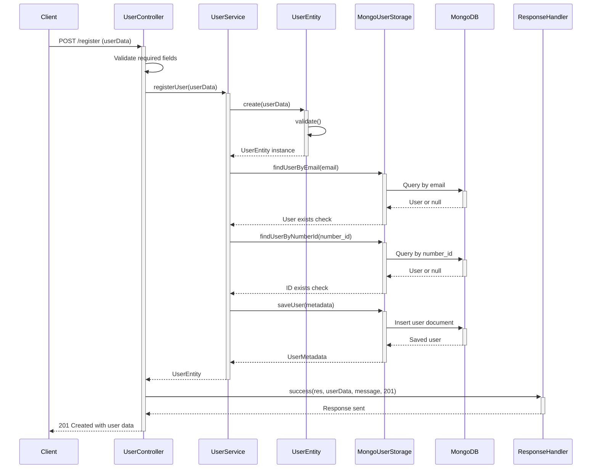
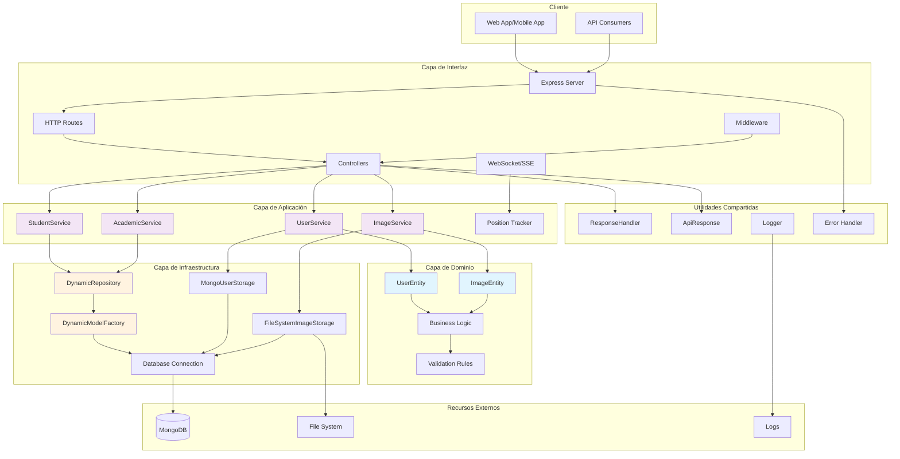

# FormArte API - Educational Platform Backend

[](https://typescript.org)
[](https://nodejs.org)
[](https://expressjs.com)
[](https://mongoosejs.com)
[](https://jestjs.io)

## 📋 Table of Contents

- [Overview](#overview)
- [Architecture](#architecture)
- [Features](#features)
- [Technology Stack](#technology-stack)
- [Prerequisites](#prerequisites)
- [Installation](#installation)
- [Configuration](#configuration)
- [Running the Application](#running-the-application)
- [Testing](#testing)
- [API Documentation](#api-documentation)
- [Database Schema](#database-schema)
- [Docker Deployment](#docker-deployment)
- [Project Structure](#project-structure)
- [Contributing](#contributing)
- [License](#license)

## 🎯 Overview

FormArte API is a comprehensive educational platform backend built with Node.js, TypeScript, and MongoDB. It provides a robust foundation for managing educational content, student progress tracking, assessments, and real-time communication in educational environments.

The platform supports:
- 🎓 Student and educator management
- 📚 Dynamic educational content management
- 📊 Progress tracking and analytics
- 🔍 Assessment and evaluation systems
- 📱 Mobile app integration
- 🔄 Real-time notifications via WebSocket
- 📄 PDF report generation
- 🖼️ Image and file management

## 🏗️ Architecture

This project follows **Clean Architecture** (Hexagonal Architecture) principles with clear separation of concerns:

```
┌─────────────────────────────────────────────────────────────┐
│                    Interface Layer                          │
│  ┌─────────────────┐  ┌─────────────────┐  ┌─────────────┐ │
│  │   HTTP Routes   │  │   Controllers   │  │  WebSocket  │ │
│  └─────────────────┘  └─────────────────┘  └─────────────┘ │
├─────────────────────────────────────────────────────────────┤
│                   Application Layer                         │
│  ┌─────────────────┐  ┌─────────────────┐  ┌─────────────┐ │
│  │    Services     │  │   Use Cases     │  │   Ports     │ │
│  └─────────────────┘  └─────────────────┘  └─────────────┘ │
├─────────────────────────────────────────────────────────────┤
│                     Domain Layer                            │
│  ┌─────────────────┐  ┌─────────────────┐  ┌─────────────┐ │
│  │    Entities     │  │ Business Rules  │  │ Validations │ │
│  └─────────────────┘  └─────────────────┘  └─────────────┘ │
├─────────────────────────────────────────────────────────────┤
│                 Infrastructure Layer                        │
│  ┌─────────────────┐  ┌─────────────────┐  ┌─────────────┐ │
│  │    Database     │  │  File Storage   │  │  External   │ │
│  │   (MongoDB)     │  │  (FileSystem)   │  │  Services   │ │
│  └─────────────────┘  └─────────────────┘  └─────────────┘ │
└─────────────────────────────────────────────────────────────┘
```

### Key Architectural Patterns:
- **Dependency Injection**: Loose coupling between components
- **Repository Pattern**: Data access abstraction
- **Port-Adapter Pattern**: Clean separation of business logic and infrastructure
- **Factory Pattern**: Dynamic model creation
- **Command Pattern**: Service methods as commands

## 📊 Diagramas del Sistema

### Diagrama de Clases

```mermaid
classDiagram
    %% Domain Layer - Entities
    class UserMetadata {
        +number type_id
        +string number_id
        +string name
        +string second_name
        +string last_name
        +string second_last
        +string email
        +string password
        +string cellphone
        +string locate_district
        +string type_user
        +string gender
        +string programa
        +string birthday
        +Date createdAt
    }

    class UserEntity {
        -UserMetadata metadata
        +create(userData) UserEntity
        +getMetadata() UserMetadata
        +validate() boolean
    }

    class ImageMetadata {
        +string filename
        +string mimeType
        +number size
        +Date createdAt
    }

    class ImageEntity {
        -string id
        -ImageMetadata metadata
        -string url
        -string fullUrl
        +create(metadata, url, fullUrl) ImageEntity
        +getId() string
        +getMetadata() ImageMetadata
        +getUrl() string
        +getFullUrl() string
        +toJSON() object
    }

    %% Application Layer - Services
    class UserService {
        -UserStoragePort userStorage
        +registerUser(userData) UserEntity
        +loginUser(email, password) object
    }

    class StudentService {
        -DynamicRepository repository
        +getStudentPosition(grado, id_student) StudentPosition
        +updateStudentsBulk(collection, students) BulkUpdateResult
        +createStudentsUnique(collection, students) BulkCreateResult
        +getStudentById(collection, id) any
        +updateStudent(collection, id, data) any
        +deleteStudent(collection, id) any
        +getAllStudents(collection) any[]
        +removeExamenAsignado(ids, id_simulacro) object
    }

    class AcademicService {
        -DynamicRepository repository
        +getAreasByIds(grado, ids) AreaWithQuestions[]
        +getSubjectsByIds(grado, ids) SubjectWithQuestions[]
        +getSubjectById(id, grado) SubjectWithQuestions
        +generateSimulacro(value, cantidad) SimulacroData
        +getQuestionById(id) any
        +getQuestionsByTypeAndArea(programa, area) QuestionsByTypeAndArea[]
        +getAcademicLevelByScore(collection, id, score) any
    }

    class ImageService {
        -ImageStoragePort imageStorage
        +uploadImage(imageBase64, requestInfo) ImageEntity
        +uploadMultipleImages(imagesBase64, requestInfo) ImageEntity[]
    }

    %% Infrastructure Layer
    class DynamicModelFactory {
        -Map~string,Model~ modelCache
        -Map~string,Schema~ schemaCache
        -CacheStats cacheStats
        +getInstance() DynamicModelFactory
        +getModel(collection, schema, options) Model
        +preloadModels(collections) void
        +invalidateCache(collection) void
        +getCacheStats() CacheStats
        +getCollectionStats(collection) object
    }

    class DynamicRepository {
        -DynamicModelFactory modelFactory
        +findById(collection, id) any
        +findOne(collection, query) any
        +find(collection, query, projection) any[]
        +create(collection, data) any
        +updateById(collection, id, data) any
        +deleteById(collection, id) any
        +bulkUpdate(collection, students) BulkUpdateResult
        +bulkCreateUnique(collection, students) BulkCreateResult
        +searchByField(collection, field, value) any[]
    }

    class MongoUserStorage {
        +saveUser(metadata) UserMetadata
        +findUserByEmail(email) UserMetadata
        +findUserByNumberId(numberId) UserMetadata
        +validateUserCredentials(email, password) UserMetadata
    }

    class FileSystemImageStorage {
        +saveImage(buffer, metadata, requestInfo) object
        +saveMultipleImages(images, requestInfo) object[]
    }

    %% Interface Layer - Controllers
    class UserController {
        +registerUser(req, res) void
        +loginUser(req, res) void
    }

    class ImageController {
        +uploadImage(req, res) void
        +uploadMultipleImages(req, res) void
    }

    %% Utility Classes
    class ApiResponse {
        +success(res, data, message, statusCode, meta) Response
        +error(res, error, statusCode, details) Response
        +paginated(res, data, page, limit, total, message) Response
        +created(res, data, message) Response
        +updated(res, data, message) Response
        +deleted(res, message) Response
        +notFound(res, message) Response
        +badRequest(res, message, details) Response
        +bulk(res, results, message) Response
    }

    class ResponseHandler {
        +success(res, data, message, statusCode) any
        +error(res, error, message, statusCode) any
        +badRequest(res, message) any
        +notFound(res, message) any
    }

    %% Data Transfer Objects
    class StudentPosition {
        +number posicion
        +number n_estudiantes
    }

    class AreaWithQuestions {
        +string _id
        +string value
        +string[] childrents
    }

    class SubjectWithQuestions {
        +string _id
        +string value
        +string[] childrents
    }

    class SimulacroData {
        +string[] data
    }

    class QuestionsByTypeAndArea {
        +string pregunta
        +string cod
        +string id
        +string area
    }

    class BulkUpdateResult {
        +any[] updated
        +any[] notFound
    }

    class BulkCreateResult {
        +any[] created
        +any[] existing
    }

    %% Interfaces
    class UserStoragePort {
        <<interface>>
        +saveUser(metadata) UserMetadata
        +findUserByEmail(email) UserMetadata
        +findUserByNumberId(numberId) UserMetadata
        +validateUserCredentials(email, password) UserMetadata
    }

    class ImageStoragePort {
        <<interface>>
        +saveImage(buffer, metadata, requestInfo) object
        +saveMultipleImages(images, requestInfo) object[]
    }

    %% Relationships
    UserEntity *-- UserMetadata
    ImageEntity *-- ImageMetadata
    
    UserService --> UserEntity
    UserService --> UserStoragePort
    ImageService --> ImageEntity
    ImageService --> ImageStoragePort
    StudentService --> DynamicRepository
    AcademicService --> DynamicRepository
    
    MongoUserStorage ..|> UserStoragePort
    FileSystemImageStorage ..|> ImageStoragePort
    
    DynamicRepository --> DynamicModelFactory
    DynamicModelFactory --> ModelOptions
    DynamicModelFactory --> CacheStats
    
    StudentService --> StudentPosition
    StudentService --> BulkUpdateResult
    StudentService --> BulkCreateResult
    AcademicService --> AreaWithQuestions
    AcademicService --> SubjectWithQuestions
    AcademicService --> SimulacroData
    AcademicService --> QuestionsByTypeAndArea
    
    UserController --> UserService
    ImageController --> ImageService
    
    UserController --> ResponseHandler
    UserController --> ApiResponse
```


### Diagrama de Secuencia - Registro de Usuario


### Diagrama de Componentes - Arquitectura del Sistema



## ✨ Features

### Core Features
- 👤 **User Management**: Registration, authentication, profile management
- 🔐 **JWT Authentication**: Secure token-based authentication
- 📚 **Dynamic Content Management**: Flexible schema for educational content
- 📊 **Progress Tracking**: Automated student progress monitoring
- 🏆 **Ranking System**: Real-time position tracking
- 🔍 **Advanced Search**: Multi-field search with regex support
- 📱 **Mobile App Support**: Dedicated mobile endpoints

### Educational Features
- 📝 **Assessment System**: Question management and evaluation
- 📈 **Analytics Dashboard**: Performance analytics and reporting
- 🎯 **Simulacros**: Practice test generation
- 📋 **Bulk Operations**: Efficient batch processing
- 🏫 **Institution Management**: Multi-institution support
- 📚 **Subject Classification**: Organized content structure

### Technical Features
- 🚀 **Real-time Communication**: WebSocket integration
- 📄 **PDF Generation**: Dynamic report creation
- 🖼️ **Image Processing**: Upload and management
- 💾 **File Storage**: Secure file handling
- 🔄 **Background Jobs**: Automated position tracking
- 📊 **Data Import**: Excel file processing

## 🛠️ Technology Stack

### Backend
- **Runtime**: Node.js 20.13.0
- **Language**: TypeScript 5.7.2
- **Framework**: Express.js 4.19.2
- **Database**: MongoDB with Mongoose 8.4.3
- **Authentication**: JWT (jsonwebtoken 9.0.2)
- **Password Hashing**: bcrypt 5.1.1

### File Processing
- **File Upload**: Multer 1.4.5
- **PDF Generation**: PDF-lib 1.17.1, Puppeteer 24.6.1
- **Template Engine**: EJS 3.1.10
- **Excel Processing**: xlsx 0.18.5

### Testing
- **Testing Framework**: Jest 29.7.0
- **TypeScript Support**: ts-jest 29.1.1
- **HTTP Testing**: Supertest 6.3.4
- **Coverage**: Built-in Jest coverage

### Development Tools
- **TypeScript Execution**: ts-node 10.9.2
- **Hot Reload**: ts-node-dev 2.0.0
- **CORS**: cors 2.8.5
- **Environment Variables**: dotenv 16.4.5

## 📋 Prerequisites

- Node.js 20.13.0 or higher
- MongoDB 4.0 or higher
- TypeScript 5.0 or higher
- npm or yarn package manager

## 🚀 Installation

1. **Clone the repository:**
```bash
git clone <repository-url>
cd api_formarte_mongo
```

2. **Install dependencies:**
```bash
npm install
```

3. **Set up environment variables:**
```bash
cp .env.example .env
# Edit .env with your configuration
```

4. **Build the project:**
```bash
npm run build
```

## ⚙️ Configuration

Create a `.env` file in the root directory with the following variables:

```env
# Database Configuration
MONGO_URI=mongodb://localhost:27017/formarte_db

# JWT Configuration
JWT_SECRET=your-super-secret-jwt-key
JWT_EXPIRES_IN=24h

# Server Configuration
PORT=3000
NODE_ENV=development

# File Storage
UPLOAD_PATH=./storage/uploads
MAX_FILE_SIZE=10485760

# Email Configuration (if needed)
SMTP_HOST=your-smtp-host
SMTP_PORT=587
SMTP_USER=your-email
SMTP_PASS=your-password
```

## 🏃 Running the Application

### Development Mode
```bash
npm run dev
```

### Production Mode
```bash
npm run build
npm start
```

### Available Scripts
- `npm run dev`: Start development server with hot reload
- `npm run build`: Build TypeScript to JavaScript
- `npm start`: Start production server
- `npm test`: Run all tests
- `npm run test:watch`: Run tests in watch mode
- `npm run test:coverage`: Run tests with coverage report

## 🧪 Testing

The project includes comprehensive test suites:

### Run All Tests
```bash
npm test
```

### Run Tests with Coverage
```bash
npm run test:coverage
```

### Run Tests in Watch Mode
```bash
npm run test:watch
```

### Test Structure
```
tests/
├── unit/                 # Unit tests
│   ├── domain/          # Domain entity tests
│   ├── application/     # Service layer tests
│   └── shared/          # Utility tests
└── integration/         # Integration tests
    └── api.test.ts      # API endpoint tests
```

## 📚 API Documentation

### Base URL
- **Development**: `http://localhost:3000`
- **WebSocket**: `ws://localhost:3000/ws/notifications`

### Authentication
Most endpoints require JWT authentication. Include the token in the Authorization header:
```
Authorization: Bearer <your-jwt-token>
```

### Main Endpoints

#### User Management
- `POST /users/register` - Register new user
- `POST /users/login` - User authentication

#### CRUD Operations
- `GET /api/:collection` - Get all documents
- `POST /api/:collection` - Create document
- `GET /api/:collection/:id` - Get document by ID
- `PUT /api/:collection/:id` - Update document
- `DELETE /api/:collection/:id` - Delete document

#### Bulk Operations
- `POST /api/:collection/bulk` - Get multiple documents by IDs
- `PUT /api/:collection/bulk-update` - Update multiple documents
- `POST /api/:collection/bulk-create-unique` - Create unique documents

#### Search Operations
- `GET /api/:collection/search/:field/:value` - Search by field
- `GET /api/:collection/multi-search/:query` - Multi-field search
- `GET /api/:collection/category/:category` - Search by category

#### Educational Features
- `GET /api/generate-simulacro/:grade/:quantity` - Generate practice test
- `GET /api/get-my-position/:grade/:studentId` - Get student ranking
- `GET /api/preguntas-por-tipo/:program/:type/:value` - Get questions by type

#### File Management
- `POST /images/upload` - Upload single image
- `POST /images/upload-multiple` - Upload multiple images
- `POST /qualifier/upload` - Upload qualification files

#### Progress Analysis
- `GET /progress-app/analisis/global/:grade/:institute` - Global analysis
- `GET /progress-app/analisis/asignaturas/:student/:grade/:institute` - Student analysis

### Response Format
All endpoints return standardized JSON responses:
```json
{
  "success": true,
  "message": "Operation completed successfully",
  "data": { ... },
  "error": null
}
```

## 🗄️ Database Schema

### User Schema
```typescript
{
  type_id: Number,
  number_id: String (unique),
  name: String,
  second_name: String,
  last_name: String,
  second_last: String,
  email: String (unique),
  password: String (hashed),
  cellphone: String,
  locate_district: String,
  type_user: String,
  gender: String,
  programa: String,
  birthday: String,
  createdAt: Date
}
```

### Dynamic Collections
The system supports dynamic collections with flexible schemas:
- **Grados**: Grade levels
- **Asignaturas**: Subjects
- **Area**: Academic areas
- **detail_preguntas**: Question details
- **Estudiantes**: Student records
- **resultados_preguntas**: Question results

## 🐳 Docker Deployment

### Docker Compose
```bash
docker-compose up -d
```

### Manual Docker Build
```bash
docker build -t formarte-api .
docker run -p 3000:3000 formarte-api
```

### Docker Configuration
- **Base Image**: node:20.13.0-slim
- **Working Directory**: /app
- **Exposed Port**: 3000
- **Volume**: ./storage:/app/storage

## 📁 Project Structure

```
api_formarte_mongo/
├── src/
│   ├── application/           # Application layer
│   │   └── services/         # Business logic services
│   ├── domain/               # Domain layer
│   │   └── entities/         # Business entities
│   ├── infrastructure/       # Infrastructure layer
│   │   └── database/         # Database implementations
│   ├── interfaces/           # Interface layer
│   │   ├── http/             # HTTP handlers
│   │   └── websocket/        # WebSocket handlers
│   ├── main/                 # Application entry point
│   ├── shared/               # Shared utilities
│   └── utils/                # Utility functions
├── tests/                    # Test files
│   ├── integration/          # Integration tests
│   └── unit/                 # Unit tests
├── build/                    # Compiled JavaScript
├── storage/                  # File storage
│   ├── templates/            # Report templates
│   └── uploads/              # Uploaded files
├── docker-compose.yml        # Docker configuration
├── Dockerfile               # Docker build file
├── jest.config.js           # Jest configuration
├── tsconfig.json            # TypeScript configuration
└── package.json             # Project dependencies
```

## 🤝 Contributing

1. **Fork the repository**
2. **Create your feature branch**: `git checkout -b feature/amazing-feature`
3. **Run tests**: `npm test`
4. **Commit your changes**: `git commit -m 'Add amazing feature'`
5. **Push to the branch**: `git push origin feature/amazing-feature`
6. **Open a Pull Request**

### Code Style
- Follow TypeScript best practices
- Use meaningful variable names
- Add comments for complex logic
- Ensure all tests pass
- Maintain test coverage above 80%

### Before Committing
```bash
npm run build    # Ensure TypeScript compiles
npm test         # Run all tests
npm run lint     # Run linting (if configured)
```

## 📝 License

This project is licensed under the ISC License - see the [LICENSE](LICENSE) file for details.

## 🆘 Support

For support, please contact:
- **Email**: support@formarte.com
- **Documentation**: [API Docs](./docs/api.md)
- **Issues**: [GitHub Issues](https://github.com/your-repo/issues)

## 🙏 Acknowledgments

- Express.js team for the excellent framework
- MongoDB team for the robust database
- TypeScript team for type safety
- Jest team for testing framework
- All contributors and maintainers

---

**FormArte API** - Empowering education through technology 🚀